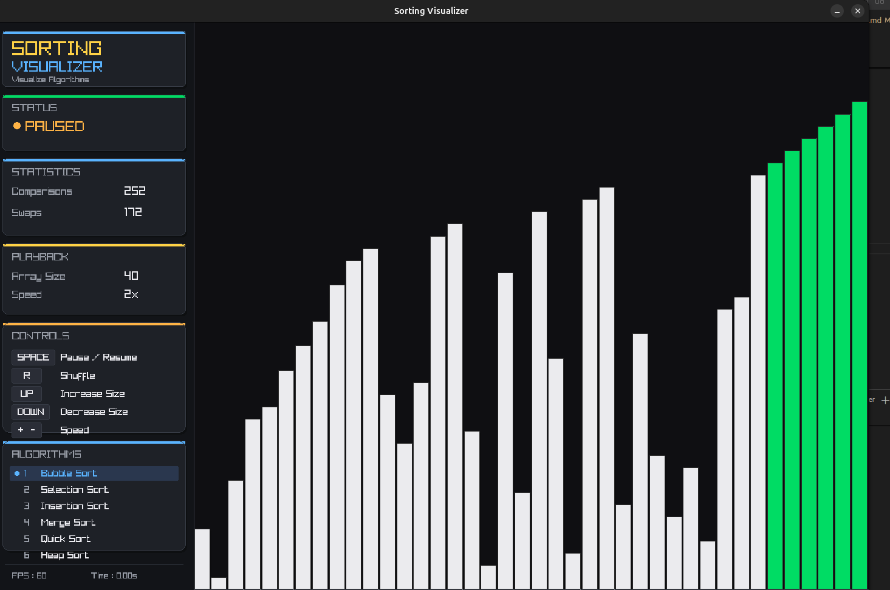

# 🎨 Sorting Visualizer

A modern **Sorting Visualizer** built in **C** using the **raylib** graphics library.

This project provides an interactive visualization of popular sorting algorithms with smooth animations, live performance statistics, and intuitive keyboard controls to help understand how different sorting techniques work.

---

## 📸 Preview

<p align="center">
    
</p>

---

## ✨ Features

- 🎨 Modern dark-themed graphical interface
- 📊 Real-time sorting visualization
- ⚡ Adjustable animation speed
- 📈 Live statistics
  - Comparisons
  - Swaps
- 🔀 Random array shuffle
- ⏸ Pause / Resume animation
- 👣 Step-by-step execution
- 📏 Dynamic array size adjustment
- 🎯 Keyboard shortcuts for quick interaction
- 🌈 Color-coded visualization
  - White → Unsorted
  - Blue → Current comparison
  - Red → Swapping
  - Green → Sorted

---

# 📚 Supported Algorithms

| Key | Algorithm |
|------|-----------|
| **1** | Bubble Sort |
| **2** | Selection Sort |
| **3** | Insertion Sort |
| **4** | Merge Sort |
| **5** | Quick Sort |
| **6** | Heap Sort |

---

# 🎮 Controls

| Key | Action |
|------|--------|
| **SPACE** | Pause / Resume |
| **R** | Shuffle Array |
| **UP** | Increase Array Size |
| **DOWN** | Decrease Array Size |
| **+** | Increase Animation Speed |
| **-** | Decrease Animation Speed |
| **N** | Execute One Step (Paused Mode) |
| **1 – 6** | Switch Sorting Algorithm |

---

# 📂 Project Structure

```text
SortVisualizer/
│
├── images/
│   └── home.png
│
├── src/
│   ├── algorithms/
│   │   ├── algorithm.h
│   │   ├── bubble_sort.c
│   │   ├── bubble_sort.h
│   │   ├── selection_sort.c
│   │   ├── selection_sort.h
│   │   ├── insertion_sort.c
│   │   ├── insertion_sort.h
│   │   ├── merge_sort.c
│   │   ├── merge_sort.h
│   │   ├── quick_sort.c
│   │   ├── quick_sort.h
│   │   ├── heap_sort.c
│   │   └── heap_sort.h
│   │
│   ├── algorithm_manager.c
│   ├── algorithm_manager.h
│   ├── renderer.c
│   ├── renderer.h
│   ├── metrics.c
│   ├── metrics.h
│   ├── array.c
│   ├── array.h
│   ├── sort_state.h
│   ├── config.h
│   └── main.c
│
├── Makefile
└── README.md
```

---

# 🛠 Technologies Used

- C
- raylib
- GCC
- Make
- Linux (Ubuntu)

---

# 🚀 Build Instructions

## Prerequisites

Install the required packages.

### Ubuntu

```bash
sudo apt update
sudo apt install build-essential libraylib-dev
```

If raylib is unavailable in your package manager:

```bash
git clone https://github.com/raysan5/raylib.git
cd raylib
mkdir build
cd build
cmake ..
make
sudo make install
```

---

## Clone the Repository

```bash
git clone https://github.com/chitrak-cs/Sort-Visualizer.git
cd Sort-Visualizer
```

---

## Build

```bash
make
```

---

## Run

```bash
./visualizer
```

---

## Clean

```bash
make clean
```

---

# 🎯 Future Improvements

- Radix Sort
- Counting Sort
- Shell Sort
- Cocktail Sort
- Tim Sort
- Intro Sort
- Smooth transition animations
- Sound effects
- Multiple color themes
- Benchmark mode
- Performance graphs
- Custom array generation
- Random data distributions
- Nearly sorted arrays
- Reverse sorted arrays

---

# 👨‍💻 Author

**Chitrak Betal**

- GitHub: https://github.com/chitrak-cs
- LinkedIn: https://www.linkedin.com/in/chitrak-betal-a5398431a/

---

## ⭐ If you found this project useful, consider giving it a star!